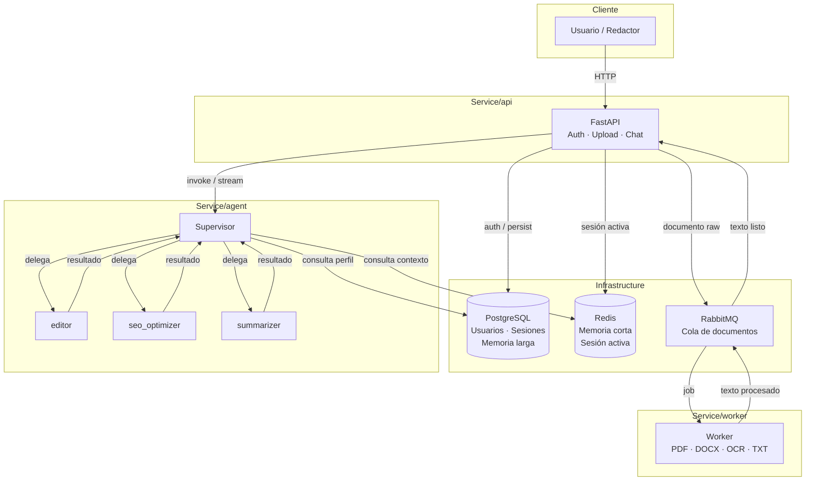

# Checklist — Orchestration SEO Agentic

> Aplicación de orquestación agéntica con patrón Supervisor (LangGraph) para redactores de canal de noticias.
> Actualizado progresivamente a medida que avanza el desarrollo.

---

## Arquitectura general

---

## Fase 0 — Diseño y planificación

- [x] Definir stack tecnológico
- [x] Definir agentes y sus responsabilidades
- [x] Proponer arquitectura de microservicios
- [x] Resolver preguntas clave (LLM, auth, memoria, OCR, frontend)
- [x] Crear este checklist

---

## Fase 1 — Estructura base del proyecto

- [x] Crear carpeta raíz `Service/` con subcarpetas por servicio
- [x] Crear `Service/api/` — esqueleto base
- [x] Crear `Service/agent/` — esqueleto base
- [x] Crear `Service/worker/` — esqueleto base
- [x] Crear `.gitignore` (incluir `.env`, `__pycache__`, etc.)
- [x] Crear `.env.example` con todas las variables necesarias

---

## Fase 2 — Infraestructura Docker

- [x] Crear `docker-compose.yml` raíz con todos los servicios
  - [x] `postgres` (imagen oficial)
  - [x] `redis` (imagen oficial)
  - [x] `rabbitmq` (imagen oficial con management UI)
  - [x] `api` (build desde `Service/api/`)
  - [x] `worker` (build desde `Service/worker/`)
  - [x] `agent` (build desde `Service/agent/`)
- [x] Crear `Service/api/Dockerfile`
- [x] Crear `Service/worker/Dockerfile`
- [x] Crear `Service/agent/Dockerfile`
- [x] Crear `.env` (credenciales reales, en `.gitignore`)

---

## Fase 3 — Servicio API (`Service/api/`)

### Base
- [x] `main.py` — FastAPI app con lifespan
- [x] `core/config.py` — Settings con Pydantic BaseSettings
- [x] `core/security.py` — JWT encode/decode, hash de password
- [x] `db/session.py` — AsyncSession SQLAlchemy + PostgreSQL
- [x] `db/base.py` — Base declarativa SQLAlchemy

### Modelos de base de datos
- [x] `models/user.py` — Usuario (id, email, hashed_password, role, created_at)
- [x] `models/chat_session.py` — Sesión de chat (thread_id, user_id, created_at)
- [x] `models/document.py` — Documento (id, user_id, filename, status, content)
- [x] `models/user_preference.py` — Preferencias de usuario (clave/valor, largo plazo)

### Schemas Pydantic
- [x] `schemas/user.py` — UserCreate, UserRead, UserUpdate
- [x] `schemas/auth.py` — Token, LoginRequest, RefreshRequest
- [x] `schemas/chat.py` — ChatRequest, ChatResponse
- [x] `schemas/document.py` — DocumentUploadResponse, DocumentStatusResponse

### Routers
- [x] `routers/auth.py` — POST /register, POST /login, POST /refresh
- [x] `routers/users.py` — GET /me, PUT /me
- [x] `routers/chat.py` — POST /chat (invoke), POST /chat/stream (SSE)
- [x] `routers/documents.py` — POST /documents/upload, GET /documents/{id}
- [x] `routers/internal.py` — PATCH /internal/documents/{id} (worker → api)

### Migraciones
- [x] Configurar Alembic (`alembic.ini` + `alembic/env.py` async)
- [x] Crear migración inicial (todas las tablas: users, chat_sessions, documents, user_preferences)
- [x] `entrypoint.sh` — aplica `alembic upgrade head` antes de arrancar uvicorn

---

## Fase 4 — Servicio Worker (`Service/worker/`)

### Cola
- [x] `queue/consumer.py` — Consumidor RabbitMQ (aio_pika)

### Procesadores de documentos
- [x] `processors/base.py` — Interfaz abstracta `DocumentProcessor`
- [x] `processors/txt_processor.py` — Lectura directa de texto plano
- [x] `processors/pdf_processor.py` — Extracción de texto (pdfplumber)
- [x] `processors/docx_processor.py` — Extracción de texto (python-docx)
- [x] `processors/image_processor.py` — OCR con Tesseract (pytesseract)
- [x] `processors/router.py` — Dispatch por MIME type

### Aplicación
- [x] `main.py` — Arranque del worker, await del consumer loop

---

## Fase 5 — Servicio Agent (`Service/agent/`)

### LLM
- [x] `llm_factory.py` — Build de AzureChatOpenAI con variables de entorno

### Core LangGraph (`__core/`)
- [x] `__init__.py` — Exports públicos
- [x] `agent_spec.py` — Dataclass AgentSpec (+ campo description)
- [x] `state.py` — SupervisorState extendido (+ user_id, session_id, task_type)
- [x] `nodes.py` — build_supervisor_node, build_agent_node, build_error_handler_node
- [x] `graph.py` — build_graph (cableado completo del StateGraph)
- [x] `orchestrator.py` — MultiAgentOrchestrator (invoke + stream_events)

### Agentes (prompts + herramientas)
- [x] `agents/editor.py` — System prompt + herramientas del editor
- [x] `agents/seo_optimizer.py` — System prompt + herramientas del SEO optimizer
- [x] `agents/summarizer.py` — System prompt + herramientas del summarizer

### Herramientas de memoria (tool-calling)
- [x] `tools/memory_tools.py`
  - [x] `save_user_preference` (PostgreSQL) — guarda preferencia de estilo del usuario
  - [x] `get_user_preferences` (PostgreSQL) — recupera preferencias del usuario
  - [x] `save_session_context` (Redis) — guarda contexto de sesión activa
  - [x] `get_session_context` (Redis) — recupera contexto de sesión activa

### API del servicio
- [x] `api/schemas.py` — AgentRequest, AgentResponse
- [x] `app/main.py` — FastAPI: POST /invoke, POST /stream, GET /health

### Checkpointer
- [ ] Migrar de MemorySaver a `AsyncPostgresSaver` (pendiente de configurar en producción)

---

## Fase 6 — Integración y pruebas

- [ ] Levantar stack completo con `docker-compose up --build`
- [ ] Verificar health check de todos los servicios
- [ ] Prueba end-to-end: registro de usuario + login
- [ ] Prueba end-to-end: subir PDF → cola → worker → texto extraído
- [ ] Prueba end-to-end: chat con `editor` (texto directo)
- [ ] Prueba end-to-end: chat con `seo_optimizer`
- [ ] Prueba end-to-end: chat con `summarizer`
- [ ] Verificar persistencia de memoria entre sesiones distintas
- [ ] Verificar aislamiento de memoria entre usuarios distintos

---

## Pendiente / Futuro

- [ ] Frontend (React + Vite)
- [ ] WebSockets para streaming en tiempo real
- [ ] Rate limiting por usuario
- [ ] Monitoreo (Prometheus + Grafana)
- [ ] CI/CD pipeline

---

## Decisiones técnicas tomadas

| Aspecto | Decisión |
|---|---|
| LLM | Azure OpenAI — `gpt-5.3-chat` |
| Auth | JWT (access + refresh token) |
| Memoria corta | Redis |
| Memoria larga | PostgreSQL (+ LangGraph AsyncPostgresSaver) |
| OCR | Tesseract vía pytesseract |
| PDF | pdfplumber |
| DOCX | python-docx |
| Cola de mensajes | RabbitMQ |
| ORM | SQLAlchemy async + Alembic |
| Frontend | React + Vite (fase posterior) |
